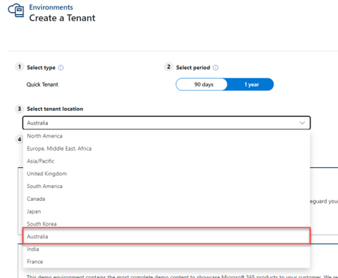
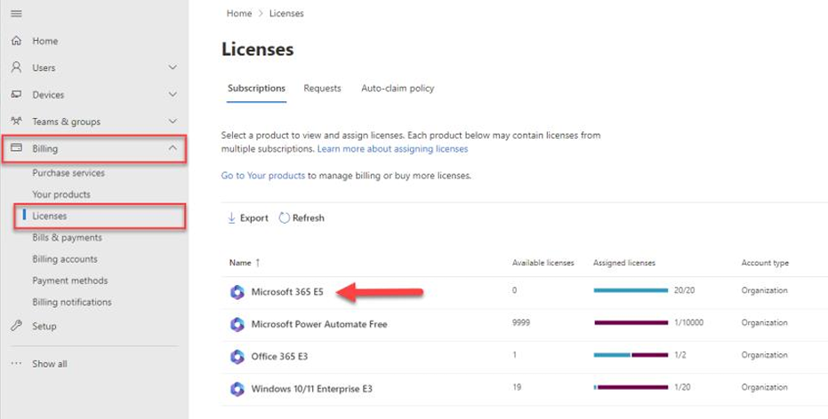
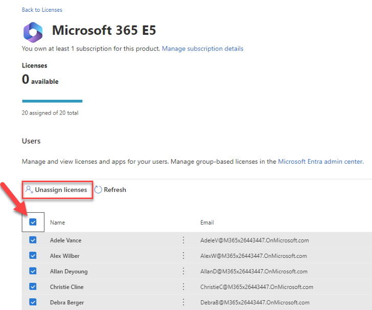

# Setup XIAD Demo Tenant

This document is intended to help setup a demo tenant environment with attendee logins provisioned  for running xIAD workshops.  Attendees’ first choice should always be to use their own account when  possible and only use the demo accounts setup during the process as an alternative when attendees do  not have the necessary pre-requisites to follow along. The script provides a set of commands to  automate creating users, assigning licenses, and creating a training environment with Microsoft  Dataverse for each user.  DO NOT add this trial to your work/production credentials. 

> [!WARNING]
>
> Do not use this on your production/live tenants. You will create a tenant below and make sure to use  those credentials.

This setup process is documented to use the Windows PowerShell ISE application. If you aren’t familiar with it you can find more information here https://docs.microsoft.com/en-us/powershell/scripting/components/ise/introducing-the-windows-powershell-ise?view=powershell-6 

## Step 1 - Create a New Training Tenant

1. Launch a web browser and navigate to the website https://demos.microsoft.com/ (this will  redirect you to https://cdx.transform.microsoft.com) 

2. Sign in with your Microsoft 365 account

   1. If this is your first time using this site, you may be prompted to enroll. When enrolling  select **Partner** for both the Segment and the Role before you click **Start**.
   2. If you receive a "`Not authorized`" or "`Login Failed`" message try clearing your browser  cache and attempt to login again.

3. Navigate to the **My Environments** tab then select your location under the Select tenant location option. 
   

   ​	What you select here will later impact the PowerShell script you run at the end of these steps.

4. Select **Create Tenant** next to the template called **Microsoft 365 Enterprise Demo Content**.

   1. Take note of the tenant name, admin email address and admin password that are  created
   2. 

## Step 2 – Add Trial Licenses to Tenant 

1. Launch a new web browser using Incognito or InPrivate mode then navigate to the website  https://admin.microsoft.com/
   1. Login with the admin email address and admin password created during Step 1
2. First, unassign the 20 Microsoft Office licenses from the accounts that were created by default  when the tenant was setup.
   1. In the left navigation, select **Billing** then **Licenses**. 
   2. Select **Microsoft 365 E5** from the list of subscriptions
      
   4. **Select all** of the licenses currently assigned (total of 20) and then choose **Unassign  licenses**. You may need to repeat this step if there are any renaming licenses still  assigned.
      
3. Next you will assign either the **Power Apps Premium** or **Power Automate Premium** license  depending on the class you are delivering:
   1. In the left navigation, select **Billing** then **Purchase services**. 
   2. **<u>For App in a Day:</u>** Use the product category search and type "`Power Apps`" and select  Details under the **Power Apps Premium** product. Click **Start free trial** and provide the  information needed for the trial sign up.
      1. You will be prompted to enter payment information that must be provided to  continue forward. At the end of these instructions, you can remove your  payment details under **Billing -> Payment methods** to ensure your credit card is  not used 
   3. <u>**For Automation in a Day:**</u> Use the product category search and type “Power Automate”  and select **Details** under the **Power Automate Premium** product. **Click Start free trial**  and provide the information needed for the trial sign up. 
      1. You will be prompted to enter payment information that must be provided to  continue forward. At the end of these instructions, you can remove your  payment details under **Billing -> Payment methods** to ensure your credit card is  not used

## Step 3 -  Run PowerShell Setup Script

> [!NOTE]
>
> If you receive errors or messages not documented in these steps, review the known issues below for possible resolution.

1. From Windows Start search launch the **Windows PowerShell ISE** application using the **Run as  Administrator** option.

2. Select **File -> Open ->`Setup.ps1`**.

3. Run the script by pressing F5 or by clicking the play icon. This just loads the setup commands it  does not start the actual setup process.  You will know this is completed when the command  prompt becomes available again.

4. Run the `Start-AppInADay-Setup` command; use the parameters below to provide tenant and  configuration information like shown in the following example commands:
   `Start-AppInADay-Setup -TenantName ‘MX12345ABC’ -UserCount 20`

   > [!NOTE]
   >
   > When choosing your User Count keep in mind the number of licenses you have  available. 

   > [!WARNING]
   >
   > **Do NOT set the UserCount Parameter higher than 20**. You can get parameter help using: 
   >
   > `get-help Start-AppInADay-Setup -Detailed`

   > [!IMPORTANT]
   >
   > When you are prompted to login use the account setup during Step 1. **Do NOT use your  personal account**.

This should now cycle through creating your users and their environments.  This may take several  minutes.  You will see a command prompt when this is complete.  Review the log for any errors you may  need to address.  You may re-run the setup script to attempt to resolve errors that occurred during the  prior run.

It’s always good to manually review a few of the users and environments prior to your event. The users that are created follow a naming convention of labadminXX@yourtenant.onmicrosoft.com; with a password of `test@word1`. The XX is replaced by the numbered user up to the number of users  you provisioned with the script.

> [!NOTE]
>
> If you have incompatible PowerShell modules already installed you might get an error prompting  you to run `CleanupOldModules.ps1`.  Close all PowerShell sessions and run this script which will remove  all PowerShell modules used by the setup script so the setup script can then install the versions it  requires.

# Other commands available

- In the event Dataverse provisioning does not complete you can run just that using the:
  `Resume-AppInADay-CDSProvisioning`

- After an event if you want to remove the student environments you can use the:
  `Reset-AppInADay`
  
- If you want to reset and create new environments use `Start-AppInADay-Setup` **and add the  DeleteUsers option**. This will remove all student environments and create additional ones. 

  > [!WARNING]
  >
  > Ensure you do NOT run this against your personal company’s tenant. Use this script at  your own risk.

  

# Known Issues

- You might receive warning messages about PSGallery – if you wish to suppress those messages you  can use the following command to change your trust level on the gallery. 
  `Set-PSRepository -Name PSGallery -InstallationPolicy Trusted`

- Some computers have restrictive policies for running unsigned scripts – you can adjust your  execution policy using the following script:

  `Set-ExecutionPolicy -Scope Process -ExecutionPolicy Bypass` 

  More information is provided here if needed https://go.microsoft.com/fwlink/?LinkID=135170

- Sometimes on copy and paste line spacing loses formatting.  If the behavior is not as expected,  review the spacing.
